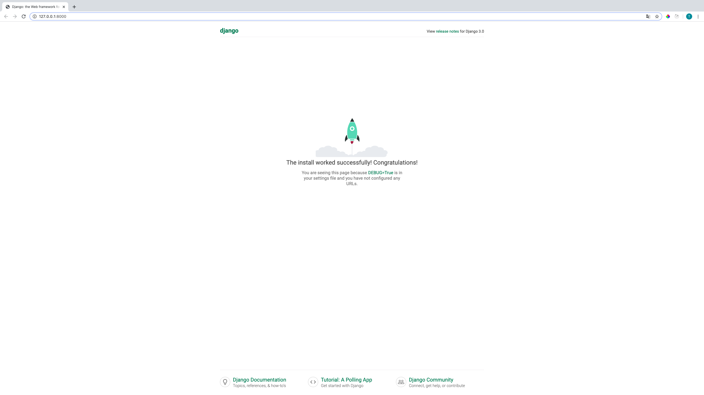
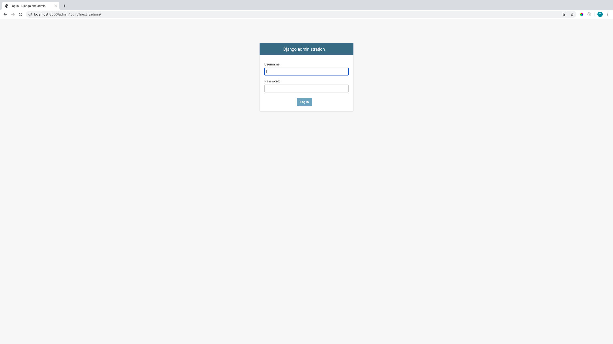
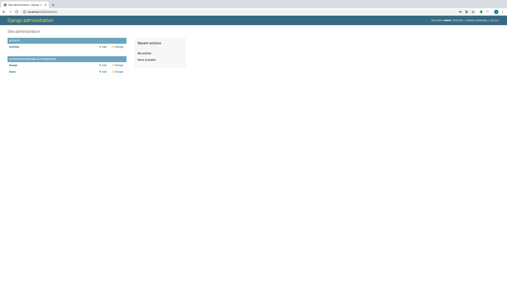
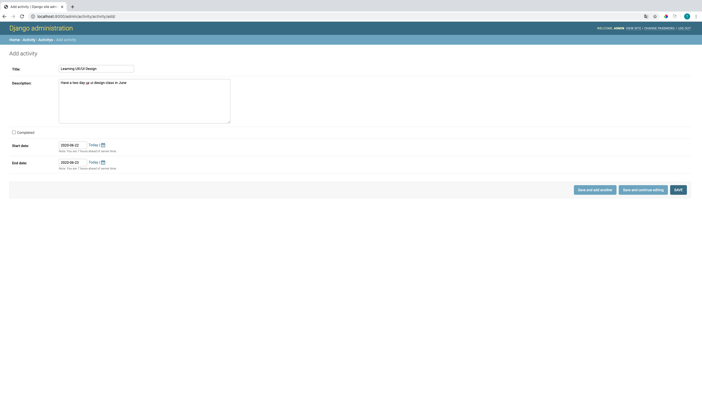
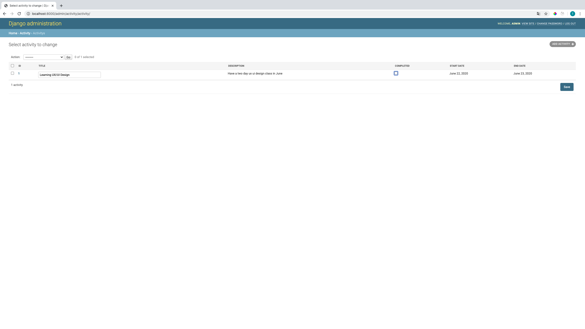

# django-react-activity

An application for recording daily to-do lists.

## Installation

Download and install [Node.Js](https://nodejs.org/en/download/) for install package.
<br/>

Install Python3

```bash
$ npm install python
```

Check Python version

```bash
$ python -V
```

Result

```bash
thiraphat.ps.dev@Mac-mini Django % python -V
Python 2.7.16
```

Install pip

```bash
$ npm install pip
```

Check pip version

```bash
$ pip -V
```

Result

```bash
thiraphat.ps.dev@Mac-mini django-react-activity % pip -V
pip 20.2b1 from /Library/Python/2.7/site-packages/pip-20.2b1-py2.7.egg/pip (python 2.7)
```

Create venv

```bash
$ python3 -m venv ./venv
```

Activate venv

```bash
$ source venv/bin/activate
```

If you want to deactivate use this command
<br>
Deactivate

```bash
$ deactivate
```

Create project directory

```bash
$ makedir django-react-activity
```

Go to root directory

```bash
$ cd django-react-activity
```

Install Django

```bash
$ pip install django
```

Check django version

```bash
$ python -c "import django; print(django.get_version())"
```

Result

```bash
(venv) thiraphat.ps.dev@Mac-mini django-react-activity % python -c "import django; print(django.get_version())"
3.0.7
```

Create project django backend

```bash
$ django-admin startproject backend
```

Structure

```bash
django-react-activity
│
└───backend
```

Go to backend folder

```bash
$ cd backend
```

Create app activity with command

```bash
$ python manage.py startapp activity
```

Structure

```bash
django-react-activity
│
└───backend
    │
    └───backend
    │
    └───activity
```

Run migrations and start server

```bash
$ python manage.py migrate
$ python manage.py runserver
```

Server is running


Register the activity app
<br>
Go to backend/settings.py to add activity app

```python
    # Application definition
    INSTALLED_APPS = [
        'django.contrib.admin',
        'django.contrib.auth',
        'django.contrib.contenttypes',
        'django.contrib.sessions',
        'django.contrib.messages',
        'django.contrib.staticfiles',
        'activity' # add activity app
      ]
```

Create directory models in activity app folder

```bash
$ cd activity
$ makedir models
```

Structure

```bash
django-react-activity
│
└───backend
    │
    └───backend
    │
    └───activity
        │
        └───models
```

Copy file **init**.py in backend folder and paste it to /models

```bash
django-react-activity
│
└───backend
    │
    └───backend
    │
    └───activity
        │
        └───models
            │
            └───__init__.py
```

Create activityModel.py file in models

```bash
django-react-activity
│
└───backend
    │
    └───backend
    │
    └───activity
        │
        └───models
            │
            └───__init__.py
            │
            └───activityModel.py

```

Add code in to activityModel.py

```python
from django.db import models
# Create your models here.

# add this
class Activity(models.Model):
    title = models.CharField(max_length=120)
    description = models.TextField()
    completed = models.BooleanField(default=False)
    start_date = models.DateField(auto_now_add=True)
    end_date = models.DateField(auto_now=True)

    def _str_(self):
        return self.title
```

And add this in to models/**init**.py

```python
from .activityModel import Activity
```

Run makemigrations

```python
$ python manage.py makemigrations activity

```

```bash
Migrations for 'activity':
  activity/migrations/0001_initial.py
    - Create model Activity
```

and migrate model

```python
$ python manage.py migrate activity
```

```bash

Operations to perform:
  Apply all migrations: activity
Running migrations:
  Applying activity.0001_initial... OK
```

Create ActivityAdmin in file backend/activity/admin.py

```python
from django.contrib import admin
from .models import Activity

class ActivityAdmin(admin.ModelAdmin):
    list_display = ('id','title', 'description', 'completed','start_date','end_date')
    list_editable = ('title','completed')

admin.site.register(Activity, ActivityAdmin)
```

Create superuser to use djangoadmin

```python
$ python manage.py createsuperuser
```

Go to django admin page and login [http://localhost:8000/admin](http://localhost:8000/admin)


Login to dashboard


You can try to add activity in Activitys click +Add


Success


**Setup API**
install dajngorest and django cors headers with command
```bash
$ pip  install djangorestframework django-cors-headers
```

And add corheaders , rest_framework app to backend/backend/setting.py
```python
INSTALLED_APPS = [
        'django.contrib.admin',
        'django.contrib.auth',
        'django.contrib.contenttypes',
        'django.contrib.sessions',
        'django.contrib.messages',
        'django.contrib.staticfiles',
        'corsheaders',            # add this app
        'rest_framework',         # add this app
        'activity',
      ]
```

Add corsMiddleware to MIDDELWARE under INSTALL_APPS
```python
    MIDDLEWARE = [
        'corsheaders.middleware.CorsMiddleware',    # add middleware
        'django.middleware.security.SecurityMiddleware',
        'django.contrib.sessions.middleware.SessionMiddleware',
        'django.middleware.common.CommonMiddleware',
        'django.middleware.csrf.CsrfViewMiddleware',
        'django.contrib.auth.middleware.AuthenticationMiddleware',
        'django.contrib.messages.middleware.MessageMiddleware',
        'django.middleware.clickjacking.XFrameOptionsMiddleware',
    ]
```

Add CORS_ORIGIN_WHITELIST bottom line in setting.py
```python
CORS_ORIGIN_WHITELIST = (
       'http://localhost:3000',   #for react frontend
)
```


Create Serializers