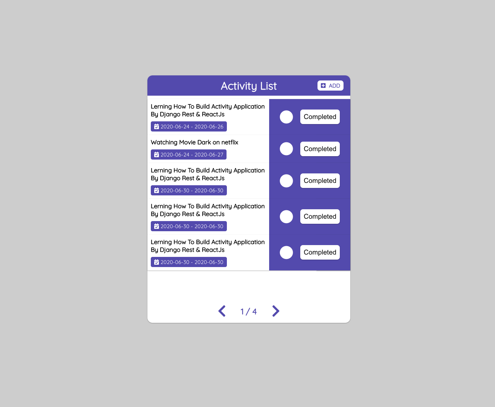

# django-react-activity

An application for recording daily to-do lists.

#Preview

</img>
</img>


## Installation with clone this project

```bash
git clone https://github.com/thiraphat-ps-dev/django-react-activity.git
```

Download and install [Node.Js](https://nodejs.org/en/download/) for install package.
<br/>

Install Python3

```bash
$ npm install python
```

Check Python version

```bash
$ python -V
```

Result

```bash
Python 2.7.16
```

Install pip

```bash
$ npm install pip
```

Check pip version

```bash
$ pip -V
```

Result

```bash
pip 20.2b1 from /Library/Python/2.7/site-packages/pip-20.2b1-py2.7.egg/pip (python 2.7)
```

Create venv python3 with command

```bash
$ python3 -m venv ./venv
```

Activate venv

```bash
$ source venv/bin/activate
```

If you want to deactivate use this command

Deactivate venv

```bash
$ deactivate
```

Go to root directory

```bash
$ cd django-react-activity
```

#Setup backend

Install Django

```bash
$ pip install django
```

Check django version

```bash
$ python -c "import django; print(django.get_version())"
```

Result

```bash
(venv) thiraphat.ps.dev@Mac-mini django-react-activity % python -c "import django; print(django.get_version())"
3.0.7
```

Go to backend folder

```bash
$ cd backend
```

migrate this backend with command

```bash
$ python manage.py migrate
```

createsuper user for use adminpage

```bash
$ python manage.py createsuperuser
```

run backend server with command

```bash
$ python manage.py runserver
```


You can go to backend api page http://localhost:8000/api/activitys/


#Setup Frontend
```bash
$ cd frontend
```

Install package with command
```bash
$ npm istall
```

Runserver with command
```bash
npm start
```

Go to frontend page http://localhost:3000/


You can try to add completed delete activity
# thank for watching
